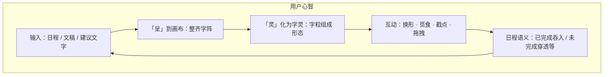
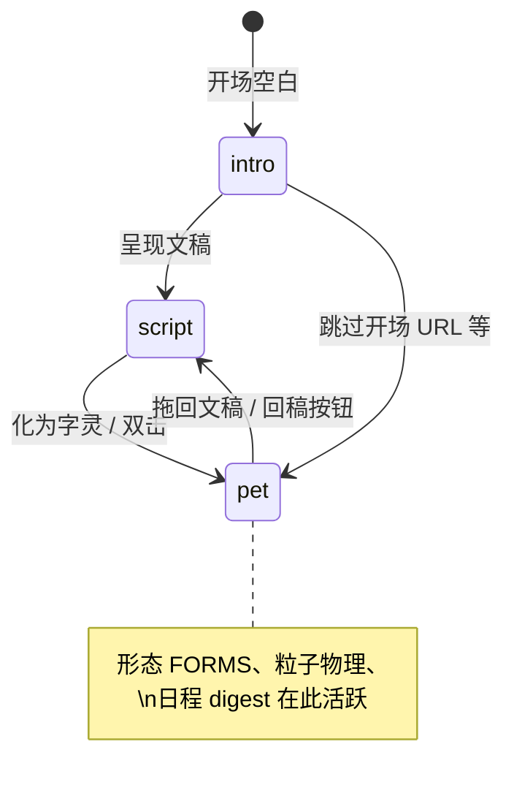
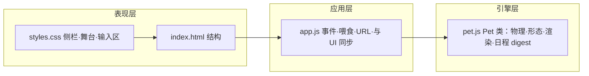
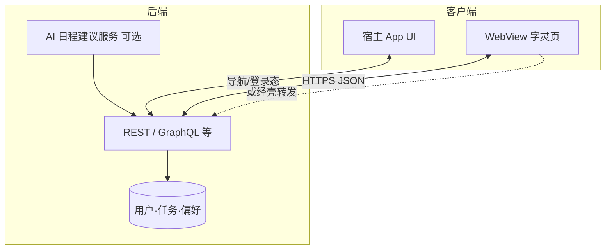

# 字灵（Zì Líng）阶段性详细汇报

> **文档性质**：产品说明 + 设计动因 + 与 App / 后端 / UI 的对接要点。  
> **关联真源**：交互与矛盾规则见 [`DESIGN.md`](./DESIGN.md)，版本与任务勾选见 [`PLAN.md`](./PLAN.md)。  
> **当前代码形态**：纯前端模块（`index.html` / `styles.css` / `app.js` / `pet.js`），可独立网页或嵌入 WebView。

---

## 1. 宠物「介绍图」——它是什么（概念示意）

下面的示意图从 **用户视角** 和 **技术状态** 两个维度概括字灵；便于向产品、设计、客户端、后端同步同一张「心智图」。

### 1.1 用户眼中的字灵

**一句话**：字灵是 **由汉字粒子在隐形格上运动、组成各种形态的活字宠物**；同一批字可以在 **文稿态** 与 **字灵态** 之间切换，并承载日程相关的轻语义反馈。

### 1.2 技术状态机（实现层）

### 1.3 模块分工（仓库内）

---

## 2. 设计原因与设计原则（为什么这样建）

| 原则 | 原因 | 对后续开发的约束 |
|------|------|------------------|
| **活字栅格** | 用户希望字「整齐、像编队」，而不是随机糊成一团；便于与「日程行」一一对应。 | 新形态优先提供 **有序目标点** 或 **可走轮廓 mask**；避免破坏 `gridMarch` 契约。 |
| **文稿 ↔ 字灵 同源** | 同一 `scriptLines` 驱动呈现与躯体字序，保证「这一段话」身份一致。 | 任何「外部写入」应通过 **`setScriptLines` + 同步躯体** 的单一入口，避免双源数据。 |
| **浅色 Apple 式 UI** | 与「宣纸古风」区分，贴近日程类 App 的系统感。 | 嵌入宿主 App 时，**主题色 / 圆角 / 安全区** 建议由宿主 CSS 变量或壳层覆盖。 |
| **纯前端零打包** | 降低嵌入成本（WebView 直接 `file://` 或远程 URL），便于热更新。 | 后端能力通过 **HTTP API + 壳层注入** 接入，不把业务绑死在构建链上。 |
| **可扩展形态库** | `FORMS` + `buildFormLayoutData` 模式支持脚本字、巨字、计时、曲线等。 | 新形态需考虑 **布局锁定**（`isLayoutLockedForm`）是否参与游走/波纹，避免「名不副实」。 |
| **清晰度管线** | Canvas 与 DPR、亚像素、叠层绘制直接影响「字糊」体验。 | 新绘制逻辑应复用 **`_snapLogicalToDevice`**、浅色躯体单层墨等约定（见 `DESIGN.md` §2.4）。 |

**矛盾处理**：以 [`DESIGN.md`](./DESIGN.md) 为准——**时间上更晚的决策覆盖更早冲突**。

---

## 3. 与 App 壳层对接（WebView / 原生 / 跨端）

### 3.1 推荐集成方式

| 方式 | 适用 | 要点 |
|------|------|------|
| **远程 URL** | 可联网、要热更新 | 加载 `https://…/index.html`，通过 **Query** 传参（如 `?form=…&mega=…&skipIntro=1`）。 |
| **本地包内 HTML** | 离线、审核包 | 与 `pet.js` 等同目录部署；注意 **file://** 下字体 CDN 策略。 |
| **WebView 双工** | 要与原生导航、登录态联动 | 使用 **`postMessage` / JSBridge** 在「壳 ↔ 页面」之间传 JSON 指令（见下节消息契约建议）。 |

### 3.2 建议的「壳 ↔ H5」消息契约（示例，非已实现代码）

以下为 **接口形状建议**，便于各端对齐；实现时可在 `app.js` 增加 `window.addEventListener('message', …)` 与 `window.parent.postMessage`（或注入的 `NativeBridge`）。

**壳 → H5（示例）**

| type | payload 示例 | 含义 |
|------|----------------|------|
| `ziling:setScript` | `{ lines: ["任务A", "任务B"] }` | 替换文稿并可选触发呈现 |
| `ziling:setForm` | `{ form: "blob" }` | 换形（键名与 `FORMS` 一致） |
| `ziling:awaken` | `{ form: null }` | 化灵 |
| `ziling:theme` | `{ mode: "light" \| "dark" }` | 与宿主深色模式同步（需在 `Pet` 上暴露 `lightCanvas` 切换） |

**H5 → 壳（示例）**

| 事件 | payload 示例 | 含义 |
|------|----------------|------|
| `ziling:ready` | `{ build: "3.3.x" }` | 页面与引擎就绪 |
| `ziling:scriptChanged` | `{ lines: [...] }` | 用户在输入区修改 |
| `ziling:scheduleDigest` | `{ ate: 1, line: "…" }` | 吞食「已完成」行（与 `tryConsumeCompletedScriptLines` 对齐） |
| `ziling:formChanged` | `{ form: "lissajous" }` | 用户换形 |

> 当前仓库 **未强制实现** 上述 Bridge；这是为 **下一阶段** 与 App 联调预留的 **统一语言**。

### 3.3 URL 与深链（已有能力）

页面已支持部分 Query（以实际 `app.js` 为准），可用于 **推送落地页** 或 **A/B 形态**：

- `form`、`mega`、`skipIntro` / `pet` 等（详见页脚说明与 [`README.md`](./README.md)）。

---

## 4. 与后端对接（数据流与职责边界）

### 4.1 职责划分（推荐）

- **字灵页**：负责 **呈现、动画、本地 digest 规则、与 `scriptLines` 绑定的躯体字**。  
- **后端**：负责 **任务 CRUD、权限、AI 生成结构化建议、多端同步**。  
- **壳层**：可选 **代填 Token**、**代发请求**（避免在 H5 里暴露密钥）。

### 4.2 建议的后端 API 形态（概念级）

| 能力 | 方法/路径（示例） | 字灵侧消费方式 |
|------|-------------------|----------------|
| 拉取今日任务行 | `GET /tasks/today` | 拼成 `scriptLines` → `setScriptLines` → 可选 `enterScriptMode` |
| 推送 AI 建议 | `POST /suggestions` 返回 `{ body: "规整文本块" }` | 调用已有 `ingestAiSuggestionBlock` 或等价解析 |
| 上报交互 | `POST /analytics/ziling` | 可选：换形次数、吞食行数（隐私合规前提下） |

**注意**：当前 `pet.js` 中的 **`ingestAiSuggestionBlock`** 等为 **前端解析约定**；与真实 AI 对接时，应以后端 **稳定 JSON 字段** 为准，再在壳或 H5 内 **映射为现有 API**。

### 4.3 同步策略

| 场景 | 建议 |
|------|------|
| **离线优先** | 字灵仍可编辑 `scriptLines`；联网后由宿主 **合并冲突**（以后端时间戳为准）。 |
| **实时协作** | WebSocket 推送任务状态 → 壳转 `ziling:setScript`；避免 H5 长连接直连多租户核心库。 |
| **敏感字** | 过滤与审计放在 **后端**；字灵仅展示脱敏结果。 |

---

## 5. 与 UI / 设计系统对接

| 维度 | 现状 | 对接建议 |
|------|------|----------|
| **布局** | 侧栏 + 舞台 + 底部文稿区 | 嵌入 App 时可 **隐藏** `script-sheet`，改由 **原生列表** 供稿，仅留画布区。 |
| **主题** | CSS 变量 `--bg`、`--accent` 等 | 宿主注入 **覆盖变量** 或与系统 Dark Mode 同步。 |
| **安全区** | `env(safe-area-inset-*)` 已在 `.app` 使用 | 全屏 WebView 时保留，避免刘海遮挡侧栏。 |
| **无障碍** | 画布为自定义绘制 | 宿主可提供 **旁白文案** 或 **等价列表视图** 作为无障碍镜像。 |
| **性能** | Canvas + 多粒子 | 低端机可降低 `particleCount`、关闭部分动效（后续可暴露 `opts` 文档）。 |

---

## 6. 当前阶段能力边界（诚实清单）

**已具备（代码层）**

- 三态视图、多形态、`scriptLines` 与躯体字序、部分日程行级 digest、GitHub Pages 部署、清晰度与布局锁定等迭代（版本见 `index.html` meta `ziling-build`）。

**未在仓库内闭环（需下一阶段）**

- 真实用户系统、任务持久化、AI 网关、WebView Bridge 正式实现、设计 Token 从宿主一键注入、性能分级策略产品化。

---

## 7. 建议的「下一阶段」交付顺序

1. **壳层 Bridge 最小实现**：`setScript` / `ready` / `formChanged` 三通。  
2. **后端只读接口**：今日任务 → 字灵文稿。  
3. **AI 建议**：后端返回固定 schema → 映射 `ingestAiSuggestionBlock`。  
4. **主题与嵌入裁剪**：单画布模式 + CSS 变量对齐宿主设计系统。

---

## 8. 文档维护

- 本文件为 **阶段性汇报**，重大架构或对接策略变更时 **更新本节日期与版本引用**即可。  
- 产品意图与冲突规则仍以 **`DESIGN.md`** 为单一真源；本汇报中的对接表若与 `DESIGN.md` 冲突，以 **`DESIGN.md` 更新为准**。

---

*（本汇报随仓库迭代；当前对应构建版本请以页面 `build` 戳或 `meta[name=ziling-build]` 为准。）*
